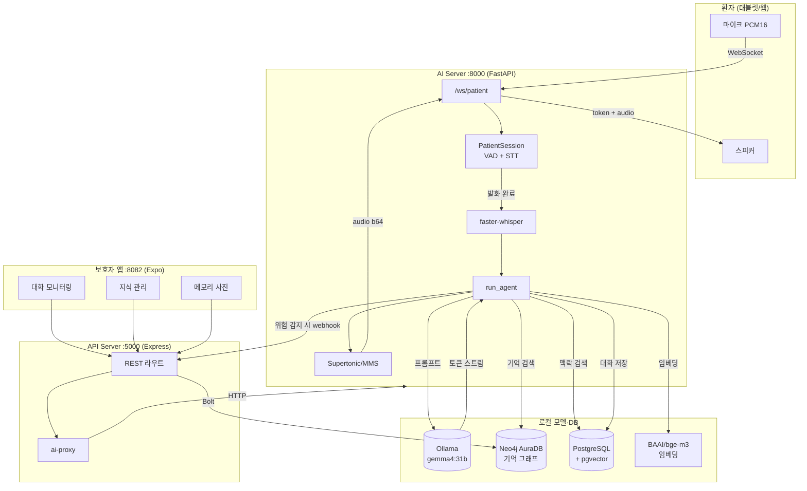

# Remini 시스템 프레임워크

> 치매 환자 AI 대화 + 보호자 모니터링 통합 시스템 아키텍처
> 작성일: 2026-05-05

---

## 1. 한눈에 보는 큰 그림

```
┌──────────────┐         ┌──────────────┐         ┌──────────────┐
│   환자       │         │   보호자     │         │   외부 모델/DB │
│ (웹/태블릿)  │         │   (Expo 앱)  │         │              │
└──────┬───────┘         └──────┬───────┘         └──────┬───────┘
       │                        │                        │
       │ WebSocket              │ REST                   │
       │ (PCM16 오디오)         │ (JSON)                 │
       │ :8000/ws/patient       │ :5000/api/...          │
       ▼                        ▼                        │
┌──────────────────┐    ┌──────────────────┐             │
│   AI Server      │◄───┤   API Server     │             │
│   FastAPI        │    │   Express        │             │
│   :8000          │    │   :5000          │             │
│                  │    │                  │             │
│  STT→LLM→TTS     │    │  ai-proxy 중계   │             │
│  메모리 검색     │    │  Neo4j 직접 쿼리 │             │
└────┬─────────────┘    └────┬─────────────┘             │
     │                       │                           │
     │                       │                           │
     ├──► Ollama (gemma4:31b)  ◄──────────────────────────┤
     ├──► faster-whisper (STT) ◄──────────────────────────┤
     ├──► Supertonic / MMS (TTS)◄─────────────────────────┤
     ├──► BAAI/bge-m3 (임베딩)  ◄─────────────────────────┤
     ├──► PostgreSQL + pgvector ◄─────────────────────────┤
     └──► Neo4j AuraDB ◄──────┴───────────────────────────┘
            (환자 메모리 그래프 + 지식)
```

---

## 2. 컴포넌트 맵 (포트·기술 스택)

| 레이어 | 컴포넌트 | 포트 | 기술 | 진입점 |
|--------|----------|------|------|--------|
| 환자 UI | 웹 (음성 대화) | 8000 | Vanilla JS + WebSocket | `ai-server/web/index.html`, `voice-loop.js` |
| AI 서버 | 음성·LLM 파이프라인 | 8000 | FastAPI + Uvicorn | `ai-server/app/main.py` |
| API 서버 | 데이터·프록시 게이트웨이 | 5000 | Express + TypeScript | `caregiver/artifacts/api-server/src/index.ts` |
| 보호자 앱 | 모니터링 대시보드 | 8082 | Expo (React Native Web) | `caregiver/artifacts/caregiver-app/app/_layout.tsx` |
| LLM | 본 응답 생성 | 11434 | Ollama (`gemma4:31b`) | `.env: OLLAMA_MODEL` |
| STT | 음성→텍스트 | 내장 | faster-whisper (small, int8, ko) | `app/services/llm.py`, `loop.py` |
| TTS | 텍스트→음성 | 내장 | Supertonic / MMS | `app/services/tts.py` |
| 임베딩 | 검색용 벡터 | 내장 | BAAI/bge-m3 | `app/services/*` |
| 그래프 DB | 환자 기억·지식 | 7687 | Neo4j AuraDB | `app/services/auradb_memory.py` |
| 관계형 DB | 대화 로그·임베딩 | 5432 | PostgreSQL + pgvector | `app/services/conversation_db.py` |

---

## 3. 환자 음성 대화 흐름 (실시간)

```
┌─────────┐  PCM16 16kHz   ┌──────────────────────────────────────────┐
│ 마이크  │ ──────────────► │  WebSocket /ws/patient                    │
│ (브라우저)│                │  PatientSession (loop.py)                │
└─────────┘                 └────────────┬─────────────────────────────┘
                                         │
                                         ▼
                            ┌──────────────────────────┐
                            │  Silero VAD              │  발화 종료 감지
                            │  is_utterance_complete() │
                            └────────────┬─────────────┘
                                         │ 완성된 발화
                                         ▼
                            ┌──────────────────────────┐
                            │  STT: faster-whisper     │  음성 → 텍스트
                            └────────────┬─────────────┘
                                         │
                                         ▼
                            ┌──────────────────────────┐
                            │  run_agent() (agent.py)  │
                            └────────────┬─────────────┘
                                         │
              ┌──────────────────────────┼──────────────────────────┐
              │ (병렬: ThreadPool)       │                          │
              ▼                          ▼                          ▼
     ┌─────────────────┐    ┌──────────────────────┐    ┌──────────────────┐
     │ classify_emotion│    │ classify_risk_level  │    │ Retrieval        │
     │ (감정 분류)     │    │ (자해/위험 발화 감지)│    │  ├ Neo4j (기억)   │
     └─────────────────┘    └──────────────────────┘    │  └ pgvector(맥락)│
                                                        └──────────────────┘
                                         │
                                         ▼
                            ┌──────────────────────────┐
                            │  Ollama gemma4:31b       │  토큰 스트리밍
                            │  generate_reply()        │
                            └────────────┬─────────────┘
                                         │
                            ┌────────────┴─────────────┐
                            │                          │
                            ▼                          ▼
                  ┌──────────────────┐    ┌──────────────────────┐
                  │ 문장 단위로 TTS  │    │ ConversationDB 저장  │
                  │ Supertonic/MMS   │    │ + sentiment 분석     │
                  └────────┬─────────┘    │ + (위험시) webhook   │
                           │              └──────────────────────┘
                           ▼
              ┌──────────────────────────┐
              │  WebSocket 응답:          │
              │  • {type: token, ...}    │
              │  • {type: audio, b64...} │
              │  • {type: done, ...}     │
              └──────────────────────────┘
                           │
                           ▼
                       환자 스피커
```

### 단계별 메시지 타입

| 타입 | 시점 | 페이로드 |
|------|------|----------|
| `token` | LLM 토큰 생성 시마다 | 텍스트 1조각 |
| `audio` | 문장 완성 시 | base64 인코딩 PCM/WAV |
| `done` | 응답 종료 | 최종 reply 전문 + 메타 |

---

## 4. 보호자 모니터링 흐름

```
┌────────────────────┐
│  보호자 (Expo Web) │
│  :8082             │
└─────────┬──────────┘
          │
          │ React Query (hooks/useApi.ts)
          ▼
┌────────────────────────────────────────────┐
│   API Server (Express :5000)               │
│                                            │
│   ┌──────────────────────────────────────┐ │
│   │ /api/patients/:id/conversations      │ │ ──► Neo4j 직접 쿼리
│   │ /api/patients/:id/knowledge          │ │ ──► Neo4j 직접 쿼리
│   │ /api/patients/:id/memory-photos      │ │ ──► AI 서버 프록시
│   │ /api/patients/:id/voice-profiles     │ │ ──► AI 서버 프록시
│   │ /ai-proxy/*                          │ │ ──► AI 서버 프록시
│   └──────────────────────────────────────┘ │
│                                            │
│   환자ID 매핑: Patient.aiUserId ↔ P001    │
└──────┬──────────────────────┬──────────────┘
       │                      │
       │ Bolt :7687           │ HTTP :8000
       ▼                      ▼
┌──────────────┐      ┌──────────────────┐
│  Neo4j       │      │   AI Server      │
│  AuraDB      │      │   (목소리/사진/  │
│              │      │    지식 메타)    │
│ • Patient    │      └──────────────────┘
│ • Memory     │
│ • Knowledge  │
│ • Conversation
└──────────────┘
```

### 보호자 앱 화면 → 데이터 매핑

| 화면 | 파일 | 데이터 소스 |
|------|------|-------------|
| 대화 목록 | `app/(tabs)/conversations.tsx` | Neo4j (대화 메타) |
| 대화 상세 | `app/conversation/[id].tsx` | Neo4j (전체 turn) |
| 지식 관리 | `app/(tabs)/knowledge.tsx` | Neo4j (life_memory, daily_care) |
| 메모리 사진 | `app/photos/` | AI 서버 프록시 |

---

## 5. 통신 패턴 요약

| 흐름 | 프로토콜 | 포트 | 용도 |
|------|----------|------|------|
| 환자 ↔ AI 서버 | **WebSocket** | 8000 | 양방향 음성 스트리밍 |
| AI 서버 → 보호자 알림 | HTTP POST | - | `caregiver_webhook` (위험 감지 시) |
| 보호자 앱 → API 서버 | REST (fetch) | 5000 | 대화/지식/사진 조회 |
| API 서버 → AI 서버 | HTTP 프록시 | 8000 | 음성 프로필·메모리 사진 등 |
| AI 서버 → Ollama | HTTP | 11434 | LLM 추론 |
| API 서버 → Neo4j | Bolt | 7687 | 그래프 쿼리 (직접) |
| AI 서버 → Neo4j | Bolt | 7687 | 환자 기억 검색·저장 |
| AI 서버 → PostgreSQL | TCP | 5432 | 대화 로그·pgvector |

---

## 6. 핵심 데이터 모델 (요약)

### Neo4j (AuraDB)

```
(:Patient {id, aiUserId, name, ...})
  -[:HAS_MEMORY]-> (:Memory {content, embedding, type, ...})
  -[:HAS_KNOWLEDGE]-> (:Knowledge {kind: 'life_memory'|'daily_care', ...})
  -[:HAD_CONVERSATION]-> (:Conversation {sessionId, startedAt, ...})
                            -[:HAS_TURN]-> (:Turn {role, text, sentiment})
```

### PostgreSQL

```
conversations    (id, user_id, started_at, ...)
turns            (id, conv_id, role, text, embedding vector(1024), sentiment)
memory_photos    (id, user_id, path, caption, embedding)
```

---

## 7. 핵심 파일 인덱스

```
ai-server/
├── app/
│   ├── main.py                    # FastAPI 진입, /ws/patient
│   ├── config.py                  # Ollama, Neo4j, 모델 경로
│   ├── conversation/
│   │   ├── loop.py                # PatientSession, VAD, STT 트리거
│   │   └── agent.py               # run_agent() 메인 파이프라인
│   └── services/
│       ├── llm.py                 # Ollama 클라이언트
│       ├── tts.py                 # Supertonic/MMS 추상화
│       ├── auradb_memory.py       # Neo4j 메모리 R/W
│       ├── conversation_db.py     # Postgres 대화 로그
│       ├── memory_photos.py       # 사진 임베딩·검색
│       └── user_identity.py       # P001 ↔ Neo4j UUID 매핑
└── web/
    ├── index.html                 # 환자 UI (태블릿)
    ├── app.js
    └── voice-loop.js              # WebSocket + PCM 마이크

caregiver/artifacts/
├── api-server/src/
│   ├── index.ts                   # Express 진입
│   ├── routes/ai-proxy.ts         # AI 서버 프록시
│   └── seed-neo4j.ts              # 초기 시드
└── caregiver-app/
    ├── app/_layout.tsx            # Expo 라우팅
    ├── app/(tabs)/
    │   ├── conversations.tsx
    │   └── knowledge.tsx
    ├── app/photos/                # 메모리 사진 관리
    └── hooks/useApi.ts            # React Query 래퍼
```

---

## 8. Mermaid 다이어그램 (GitHub 렌더링용)



---

## 9. 운영 메모

- **모든 모델은 로컬·오픈소스만** 사용 (OpenAI/Gemini/Clova 금지). `experiments/` 만 예외.
- **서버 시작·재시작은 사용자가 직접** 한다 (`start.sh` / `stop.sh` / `status.sh` / `restart.sh`).
- **Neo4j AuraDB Free-tier**: 며칠 미사용 시 자동 Paused → DNS NXDOMAIN. 채팅 500 뜨면 Aura 콘솔부터 확인.
- **메인 LLM 진실 소스**는 `.env`의 `OLLAMA_MODEL` (현재 `gemma4:31b`).
- 환자ID 매핑: `Patient.aiUserId` (Neo4j) ↔ AI 서버 `user_id` (예: `P001`).
