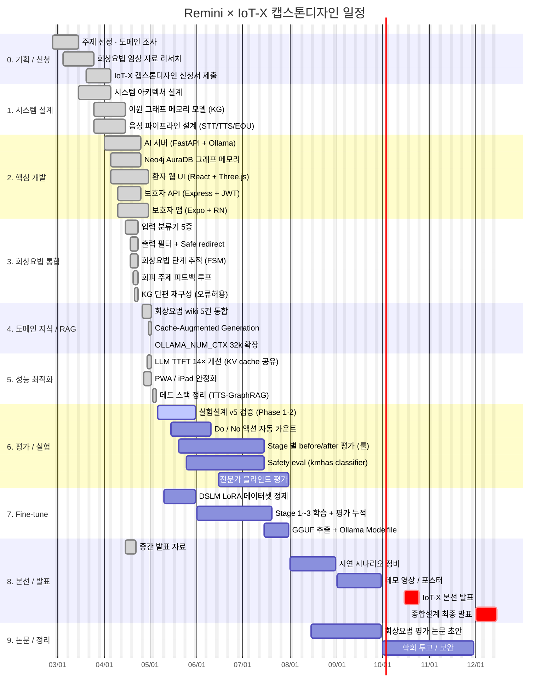

# IoT-X 캡스톤디자인 — MemorIE 팀 마일스톤 & 간트차트

> 프로젝트: **Remini** — 치매 환자 AI 회상요법 대화 + 보호자 모니터링 시스템
> 기간: 2026-02-26 ~ 2026-12-15 (10 개월)
> 본 문서는 IoT-X 출품 + 종합설계 발표용 일정 자료. 이미 완료된 단계는 `✅`, 진행 중은 `🟡`, 예정은 `⬜`.

---

## 1. 간트차트 (Mermaid)

> GitHub / Notion / VS Code Mermaid 미리보기에서 그대로 렌더됨.

---

## 2. 핵심 마일스톤 요약

| # | 마일스톤 | 목표일 | 산출물 | 상태 |
|---|----------|--------|--------|------|
| M1 | 주제 확정 + IoT-X 신청 | 2026-04-05 | 신청서, 주제선정PPT | ✅ |
| M2 | 시스템 아키텍처 동결 | 2026-04-15 | ARCHITECTURE.md, 이원 그래프 모델 | ✅ |
| M3 | MVP — 환자 음성 대화 동작 | 2026-04-23 | AI 서버 + 환자 웹 + Neo4j 연동 | ✅ |
| M4 | 회상요법 6 Phase 통합 완료 | 2026-04-23 | 분류기·필터·FSM·회피 루프 | ✅ |
| M5 | 도메인 wiki + RAG 정착 | 2026-05-02 | wiki/00~04, num_ctx 32k | ✅ |
| M6 | 성능 목표 달성 (EOT→음성 ≤4s) | 2026-05-02 | LLM TTFT 0.97s, 14× 개선 | ✅ |
| M7 | 평가 인프라 가동 | 2026-06-10 | Do/No 카운트, before/after 자동화 | 🟡 |
| M8 | Fine-tune Stage 1~3 완료 | 2026-07-20 | LoRA 어댑터, RESULTS.md 갱신 | ⬜ |
| M9 | 전문가 블라인드 평가 종료 | 2026-07-31 | 임상 점수 + 정성 코멘트 | ⬜ |
| M10 | 시연 데모 영상 / 포스터 | 2026-09-30 | 1분 데모 + A1 포스터 | ⬜ |
| M11 | **IoT-X 본선 발표** | 2026-10-25 | 발표 자료, 라이브 데모 | ⬜ |
| M12 | 종합설계 최종 발표 | 2026-12-15 | 최종 보고서, 시연 | ⬜ |

---

## 3. 단계별 책임 / 산출물

### Phase 0. 기획 (2026-02 ~ 2026-04)
- 치매 인구 통계 + 비대면 회상치료 RCT 검토
- IoT 차별점 도출: 보호자 모바일 + 환자 단말 + 클라우드 미사용
- 산출물: `docs/IoT-X 캡스톤디자인 신청서_MemorIE팀.hwp`

### Phase 1. 시스템 설계 (2026-03 ~ 2026-04)
- 3-tier: 환자 웹(Vite/React) ↔ AI 서버(FastAPI) ↔ 보호자 앱(Expo)
- 이원 그래프 메모리 + EchoRoute softmax 라우팅
- 산출물: `docs/ARCHITECTURE.md`, `docs/Remini_시스템_프레임워크.txt`

### Phase 2. 핵심 개발 (2026-04)
- AI 서버: faster-whisper large-v3 → Ollama gemma4:31b → Supertonic-2
- Neo4j AuraDB: GraphEntity / PendingKnowledge / MemoryPhoto 노드
- 환자 웹: Three.js Jarvis particle orb, Capacitor 7 PWA
- 보호자 앱: Expo SDK 54, JWT 인증, expo-router 6

### Phase 3. 회상요법 통합 (2026-04-23 완료)
- 6 Phase 88개 단위 테스트 통과
- 입력 분류기 (qwen2.5:3b 90% / 124ms) + 출력 필터 + FSM + 회피 루프

### Phase 4. 도메인 지식 (2026-04-26 ~ 2026-05-02)
- wiki 5건: 임상기초, 비대면치료 RCT, 진행자 가이드, NICE 가이드라인
- Cache-Augmented Generation (Karpathy LLM Wiki 패턴)

### Phase 5. 성능 최적화 (2026-04-29 ~ 2026-05-05)
- LLM TTFT 13.7s → 0.97s (proactive ↔ chat KV cache 공유)
- 환자 EOT → 첫 음성 18~25s → ~4s
- 죽은 백엔드 정리 (MeloTTS, XTTS, edge-tts, GraphRAG)

### Phase 6. 평가 / 실험 (2026-05-06 ~ 2026-07-31) — **현재 단계**
- Do/No 액션 자동 카운트 (책 26p 기준)
- Stage 별 before/after + safety eval (kmhas)
- 전문가 블라인드 평가

### Phase 7. Fine-tune DSLM (2026-05 ~ 2026-07)
- Unsloth + TRL + PEFT
- Stage 1: 일상 대화 톤 / Stage 2: 회상요법 / Stage 3: 안전성
- 각 stage 마다 before/after 누적 비교 (CLAUDE.md 룰)

### Phase 8. 본선 / 발표 (2026-08 ~ 2026-12)
- 시연 시나리오, 데모 영상, A1 포스터
- IoT-X 본선 (10월), 종합설계 최종 (12월)

### Phase 9. 논문 / 정리 (2026-08 ~ 2026-11)
- KCC / KSC 학회 투고 검토
- raw 로그 + evidence 는 `docs/presentation/` 누적

---

## 4. 리스크 & 컨틴전시

| 리스크 | 영향 | 대응 |
|--------|------|------|
| Neo4j Aura Free-tier 무활동 중지 | 환자 대화 503 | 월 1회 keepalive 핑 + 로컬 Neo4j Desktop 백업 |
| Fine-tune 결과가 base보다 후퇴 | Stage 평가 실패 | rollback 정책 — 이전 stage 유지, 데이터셋 재정제 |
| 본선 데모 망 단절 | 시연 불가 | 오프라인 시뮬 영상 폴백, H200 ↔ 시연장 SSH 터널 사전 점검 |
| 전문가 평가 인원 미확보 | 정량 점수 부재 | 학과 임상심리 자문 → 비전문가 패널 보조 |

---

작성일: 2026-05-05 · 다음 갱신: M7 마일스톤 종료 시 (2026-06-10 예정)
