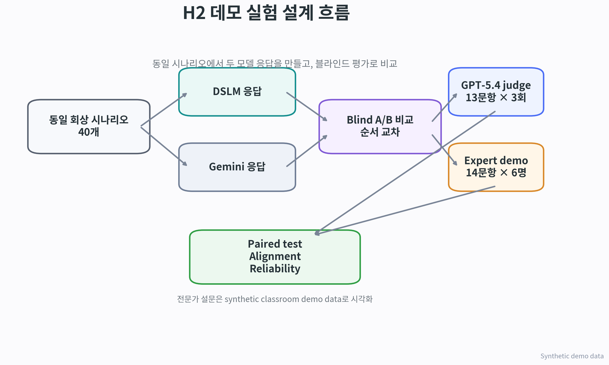
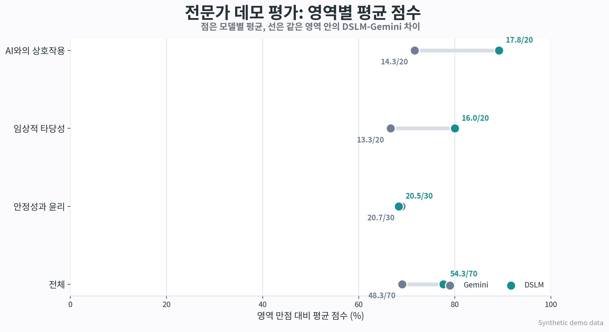
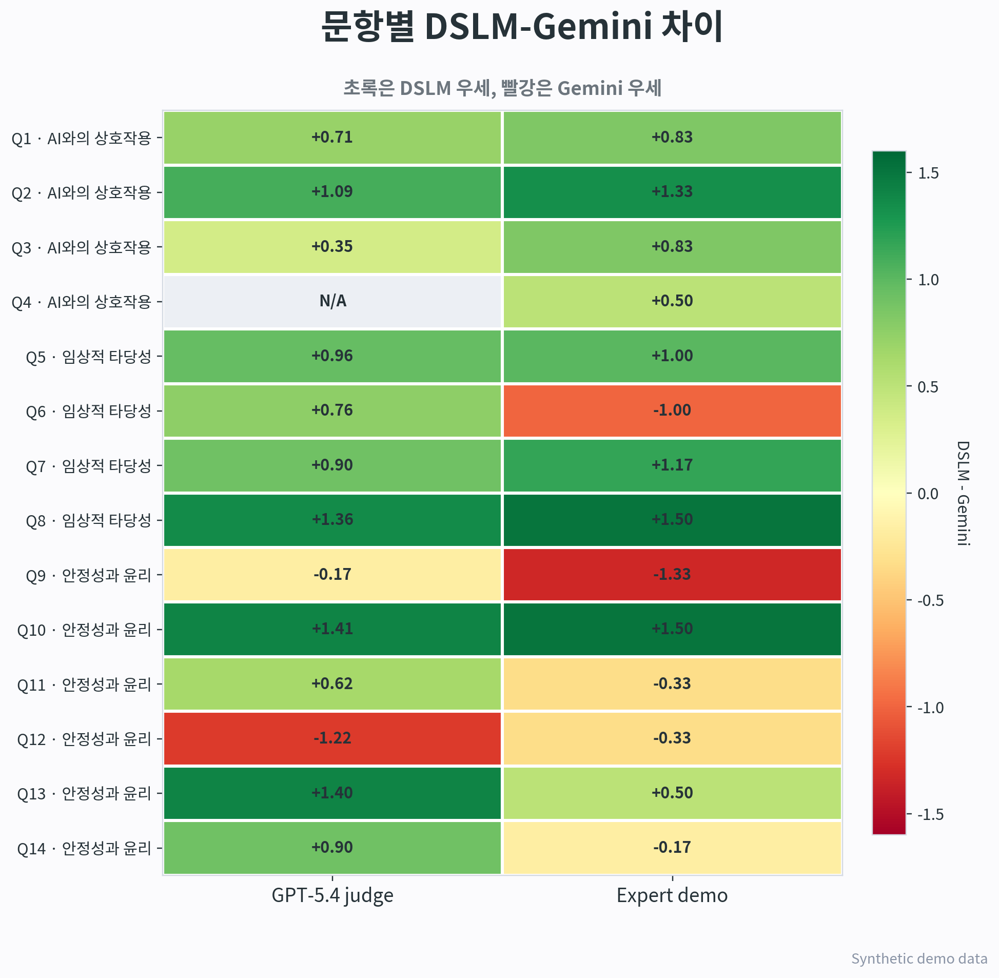
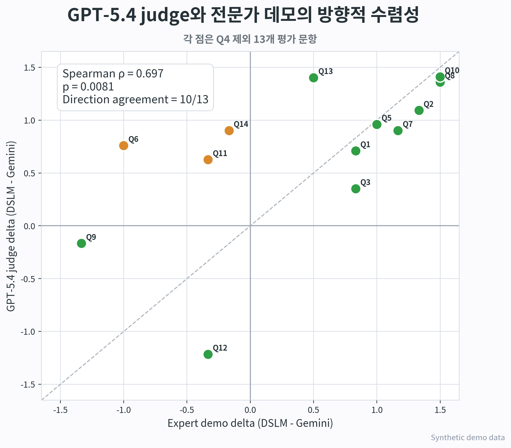
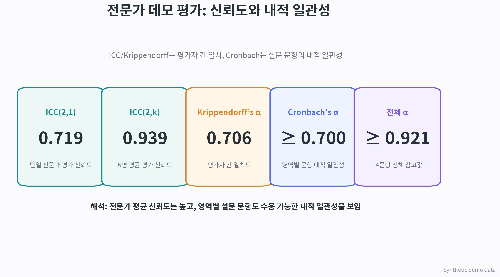
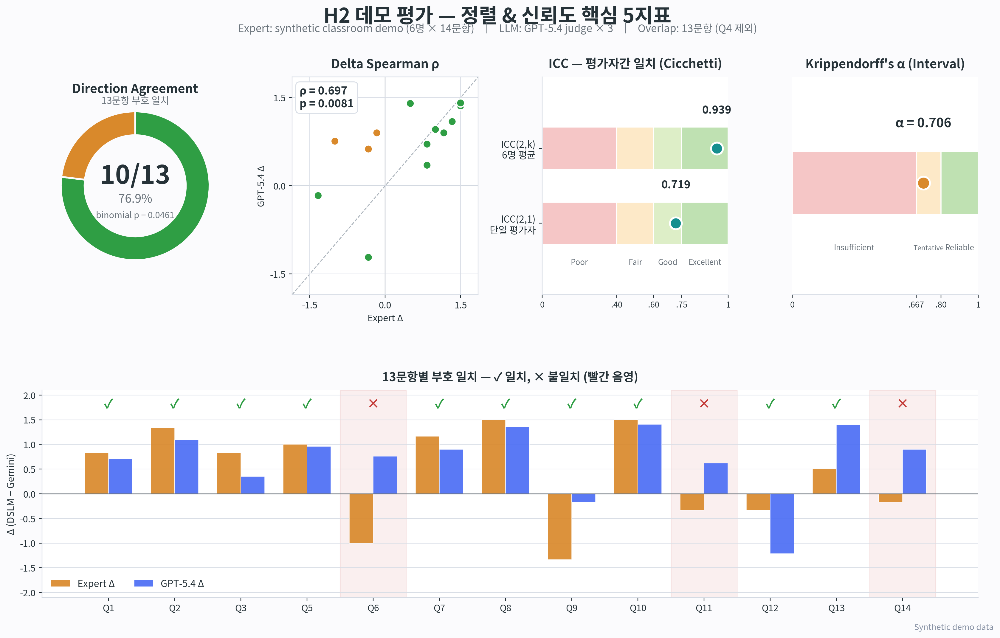

# H2 Demo Visualizations

All expert-side figures use synthetic classroom demo data only.

## 1. Experiment Flow

## 2. Area Score Dumbbell

## 3. Question Delta Heatmap

## 4. GPT-Expert Alignment Scatter

## 5. Reliability Cards

## 6. Metrics Dashboard (5 핵심 지표 한 장)

Direction Agreement · Delta Spearman ρ · ICC(2,1) · ICC(2,k) · Krippendorff α 를 13문항 detail과 함께 한 장에 정리.
생성 스크립트: `experiments/scripts/19_phase2_metrics_dashboard.py`

